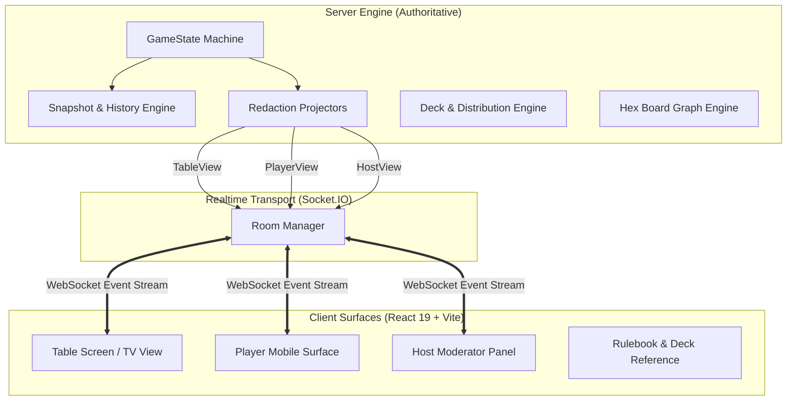
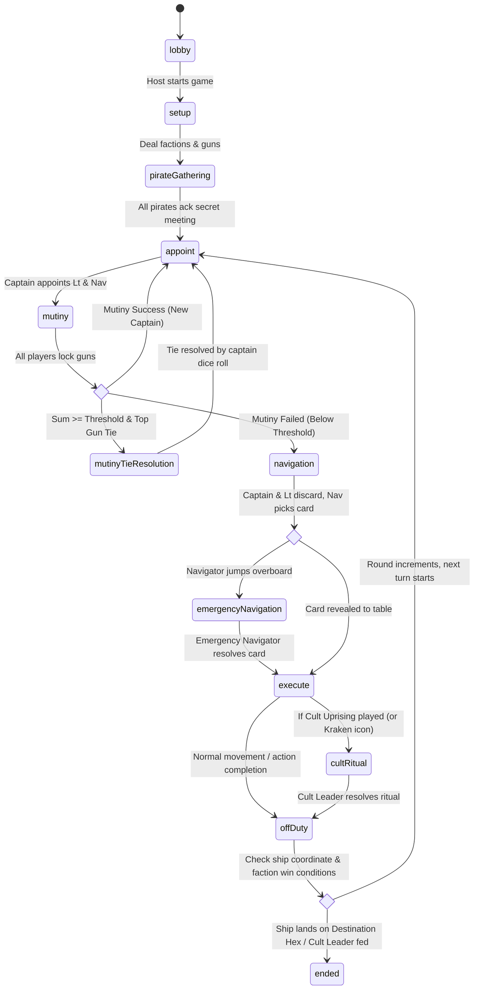
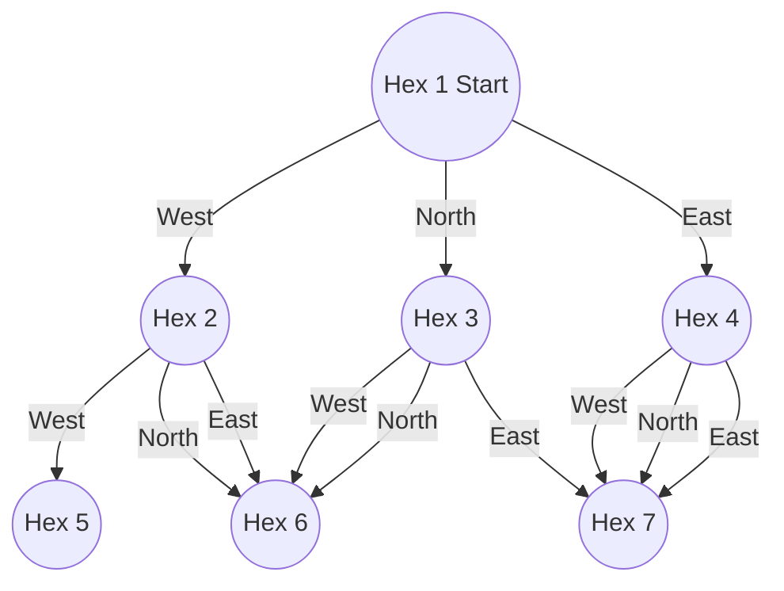
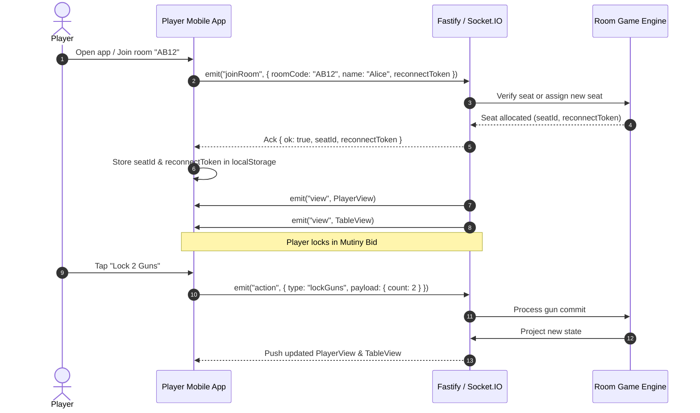
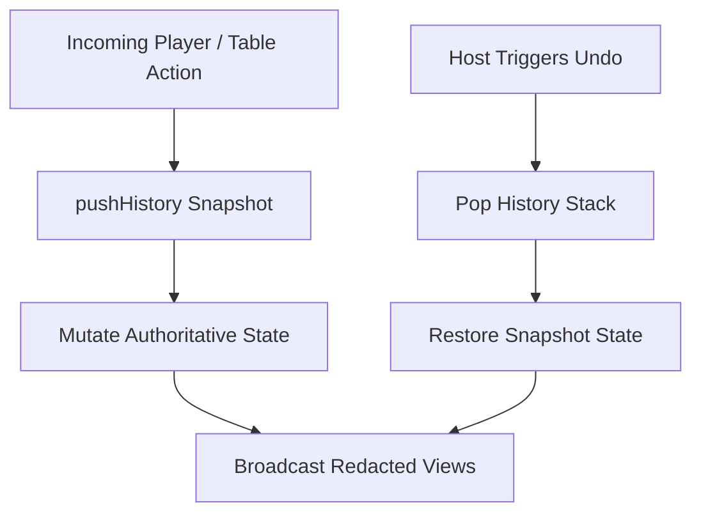

# Feed the Kraken — System Architecture & Design Document

## 1. Executive Summary & Philosophy

**Feed the Kraken** is a real-time digital companion and authoritative game engine for the hidden-role deduction board game *Feed the Kraken* (by Hans im Glück / Funtails).

### Core Philosophy
* **Physical Conversation First, Zero Screen Distraction**: The application acts as a silent, impartial secret-keeper. Accusations, bluffs, and deliberations occur verbally around the physical table. Players' phones remain dark and dormant, lighting up only when a secret choice or private role action is required.
* **Authoritative Server with Absolute Zero-Leakage**: Secret information (player factions, discarded navigation cards, hidden mutiny gun commits, cult conversion targets) is strictly maintained in server memory. Client view models are generated via unidirectional redaction projectors, guaranteeing that client devices cannot inspect memory or network traffic to infer hidden game state.
* **Resilient In-Person Play**: Games support instant reconnection via local storage tokens, live state restoration, transactional snapshot history with single-click Host Undo/Rewind, and multi-display surface integration (Shared Table TV screen, Personal Player mobile screens, Host Moderator panel).



---

## 2. Monorepo & Package Architecture

The project is structured as a TypeScript npm monorepo with strict package boundaries:

```
feed-the-kraken/
├── shared/             # @ftk/shared: Zero-dependency universal domain types & rules
│   ├── src/
│   │   ├── types.ts    # Authoritative server types & redacted client view models
│   │   ├── rules.ts    # Board game rules, composition tables, decks, thresholds
│   │   ├── maps.ts     # Hex coordinates, flat-top geometry, BOARD_MOVES graph
│   │   ├── content.ts  # Faction lore, text descriptions, action metadata
│   │   └── index.ts    # Public API exports
│   └── package.json
│
├── server/             # @ftk/server: Node.js + Fastify + Socket.IO Authoritative Server
│   ├── src/
│   │   ├── game/
│   │   │   ├── GameState.ts   # Core Authoritative State Machine & Redaction Projector
│   │   │   ├── deal.ts        # Cryptographic faction dealing algorithm
│   │   │   ├── deck.ts        # Fisher-Yates navigation deck generator & shuffler
│   │   │   ├── game.test.ts   # Unit & invariant regression test suite
│   │   │   └── sim.test.ts    # 50-game full end-to-end automated simulation tests
│   │   ├── rooms.ts           # Room code generation, connection routing, lifecycle
│   │   └── index.ts           # Fastify server entry point & HTTP/WebSocket binding
│   └── package.json
│
├── client/             # @ftk/client: React 19 + Vite + CSS Variables SPA
│   ├── src/
│   │   ├── lib/
│   │   │   ├── socket.ts      # Singleton Socket.IO client & reconnect token manager
│   │   │   └── useView.ts     # Reactive hook subscribing to server view streams
│   │   ├── surfaces/
│   │   │   ├── TableSurface.tsx   # TV/Tablet shared board & spotlight view
│   │   │   ├── PlayerSurface.tsx  # Mobile role actions, secrets & mutiny inputs
│   │   │   ├── HostSurface.tsx    # Moderator tools, state inspection & undo
│   │   │   ├── HexMap.tsx         # SVG flat-top hex board with 3D Galleon
│   │   │   ├── GuideSurface.tsx   # Interactive rules & card breakdown guide
│   │   │   ├── Faction.tsx        # Faction identity cards & role art
│   │   │   └── Home.tsx           # Lobby creation & room joining interface
│   │   ├── theme.css              # GPU-accelerated theme, animations & layouts
│   │   └── main.tsx               # Client router & app mount
│   └── package.json
│
├── feed the kraken rules.pdf # Official physical board game rules reference
├── wallpaper.jpg             # High-resolution box artwork background
└── package.json              # Monorepo workspaces & root build scripts
```

---

## 3. Core Domain Model & Game Rules Engine

### 3.1. Faction Distribution & Deal Matrix
The server dynamically deals secret roles based on player count (5–11 players) according to the official rulebook:

| Players | Sailors (🔵) | Pirates (🔴) | Cult Leader (🟡) | Cultists (🟢) | Total Roles |
| :---: | :---: | :---: | :---: | :---: | :---: |
| **5** | 3 (or 2) | 1 (or 2) | 1 | 0 | 5 (Hidden deck draw) |
| **6** | 3 | 2 | 1 | 0 | 6 |
| **7** | 4 | 2 | 1 | 0 | 7 |
| **8** | 4 | 3 | 1 | 0 | 8 |
| **9** | 4 | 4 | 1 | 0 | 9 |
| **10** | 5 | 4 | 1 | 0 | 10 |
| **11** | 5 | 4 | 1 | 1 (Setup Cultist) | 11 |

*Design Implementation*:
- For 5-player games, `dealFactions()` generates two possible subsets (`3S-1P-1C` and `2S-2P-1C`) and randomly chooses one so player composition is completely hidden from the table.
- For 11-player games, one player is dealt a `cultist` card at setup. Unlike converted cultists during gameplay, setup cultists **do not** know who the Cult Leader is until converted/communicated.

### 3.2. Gun Economy & Mutiny Mathematics
- **Global Supply Pool**: Starts with `TOTAL_GUNS = 26` guns.
- **Starting Allocation**: Every active seat receives `STARTING_GUNS_PER_PLAYER = 1` gun at setup.
- **Mutiny Threshold**: Calculated dynamically via `mutinyThreshold(activePlayerCount)`:
  $$\text{Threshold} = \lfloor \frac{\text{Active Players}}{2} \rfloor + 1$$
- **Conservation of Guns**: Guns locked into a successful mutiny are discarded back into the supply pool. If a mutiny fails, committed guns return to their respective owners.
- **Supply Line Crossing**: When the ship crosses the supply line (above spaces 8–12), the server automatically refills every active player's personal supply back up to 3 guns from the global supply pool.

### 3.3. Navigation Deck Composition (Long Journey — 23 Cards)
The navigation deck strictly reflects the 23-card physical composition:
- **Red / West / Pirate Cards (11 Cards)**:
  - $5\times$ Drunk (🍾)
  - $2\times$ Armed (➕)
  - $2\times$ Mermaid (🧜)
  - $2\times$ Telescope (🔭)
- **Blue / East / Sailor Cards (6 Cards)**:
  - $4\times$ Drunk (🍾)
  - $2\times$ Disarmed (➖)
- **Yellow / North / Cult Cards (6 Cards)**:
  - $6\times$ Cult Uprising (🕯️)

---

## 4. State Machine & Game Phases

The authoritative engine (`GameState.ts`) manages 12 discrete lifecycle phases:



### Phase Details
1. **`lobby`**: Players join via 4-character room codes. Host can reorder physical seat placement clockwise around the table.
2. **`setup`**: Guns dealt, role cards dealt securely in memory.
3. **`pirateGathering`**: Pirates receive a synchronized night screen displaying all other pirate allies. Non-pirates see a sleeping crew screen.
4. **`appoint`**: Active Captain appoints an eligible Lieutenant and Navigator (players off-duty or eliminated cannot be appointed).
5. **`mutiny`**: Non-captain players privately bid 0 to $N$ guns on their phones. Gun counts are hidden from everyone until all bids are locked in.
6. **`mutinyTieResolution`**: If a mutiny succeeds with equal top bids, the current Captain designates who among the tied mutineers becomes Captain.
7. **`navigation`**:
   - Step 1: Captain draws 2 cards from draw pile, privately discards 1.
   - Step 2: Lieutenant draws 2 cards, privately discards 1.
   - Step 3: Server shuffles the 2 remaining cards.
   - Step 4: Navigator receives the 2 cards, chooses 1 to steer and discards the other (or chooses to jump overboard).
8. **`emergencyNavigation`**: If navigator jumps overboard, navigator is eliminated, and the Captain names an emergency navigator who must execute navigation without mutiny.
9. **`execute` (Movement Steps I, II, III)**:
   - **Step I (Ship Movement)**: Ship moves to target space according to card direction.
   - **Step II (Map Space Action)**: Map space action executes (Cabin Search, Flogging, Off with his Tongue, Feed the Kraken).
   - **Step III (Navigation Card Action)**: Card action executes (Drunk, Armed, Disarmed, Mermaid, Telescope, Cult Uprising).
10. **`cultRitual`**: Cult Leader chooses and resolves a ritual card (Conversion, Gun Stash, Cult Cabin Search).
11. **`offDuty`**: Navigation team members receive off-duty badges; previous off-duty players return to active status.
12. **`ended`**: Victory triggers (Crimson Cove for Pirates, Bluewater Bay for Sailors, Kraken / Cult conversion victory for Cult). Full faction identities and voyage statistics are revealed.

---

## 5. Security & Zero-Leakage Projector Pattern

To guarantee fair play in social deduction, the server employs a **Projector Architecture**. Internal state is never directly serialized. Instead, three distinct projection functions generate tailored view models:

```mermaid
flowchart LR
    State[(Authoritative GameState)]
    
    State -->|viewForTable()| TV[TableView]
    State -->|viewForPlayer(seatId)| PV[PlayerView]
    State -->|viewForHost()| HV[HostView]

    subgraph "TV Projection Filters"
        TV -.- f1[Redact all player factions]
        TV -.- f2[Redact mutiny gun counts during bidding]
        TV -.- f3[Redact draw/discard pile card contents]
    end

    subgraph "Player Projection Filters"
        PV -.- p1[Show ONLY own faction & pirate allies]
        PV -.- p2[Show ONLY cards in own active hand]
        PV -.- p3[Show Cult Leader ONLY if converted or leader]
    end

    subgraph "Host Projection Filters"
        HV -.- h1[Include full state inspection & undo history]
    end
```

### Mathematical Redaction Invariants
- **Faction Redaction**: In `viewForTable()`, `seat.faction` is entirely omitted from the data model. In `viewForPlayer(seatId)`, only `ownFaction` is provided; other players' factions are never transmitted.
- **Draw Pile Masking**: Clients receive `drawPileCount: number` and `discardPileCount: number`, never array contents or card orders.
- **Mutiny Bid Secrecy**: During `mutiny`, `PublicSeat.guns` is projected as `null`. Only when all bids lock is the array of revealed bids broadcast.
- **Cabin Search Secrecy**: When a Captain searches a cabin, the resulting faction card is sent directly to that Captain's `PlayerView.pending`, with zero trace in the public `TableView`.

---

## 6. Hexagonal Map Geometry & Vector Pipeline

The game board is represented as an axial coordinate flat-top hexagonal lattice.

### 6.1. Coordinates & Flat-Top Hex Packing
Hex centers in screen space are calculated using flat-top axial geometry:
$$x = \text{col} \times 1.5 \times s$$
$$y = -\text{level} \times \frac{\sqrt{3}}{2} \times s$$
where $s$ is the outer radius of the hexagon and $H = \frac{\sqrt{3}}{2}$.

Parity constraint: A space is mathematically valid if and only if:
$$(\text{col} + \text{level}) \pmod 2 = 0$$

### 6.2. Directed Navigation Graph (`BOARD_MOVES`)
The board contains 31 numbered spaces. Navigation is defined by an adjacency graph mapping `(node, direction) -> target_node`:
- `west` (🔴 Red / Port): Slopes upwards-left.
- `north` (🟡 Yellow / Ahead): Climbs straight north.
- `east` (🔵 Blue / Starboard): Slopes upwards-right.



### 6.3. Continuous Supply Line Polyline
The supply line forms a continuous ridge tracing the upper perimeter of spaces 8, 9, 10, 11, and 12:

$$\text{Path} = (-4s, -4Hs) \to (-3.5s, -5Hs) \to (-2.5s, -5Hs) \to (-2s, -6Hs) \to (-s, -6Hs) \to (-0.5s, -7Hs) \to (0.5s, -7Hs) \to (s, -6Hs) \to (2s, -6Hs) \to (2.5s, -5Hs) \to (3.5s, -5Hs) \to (4s, -4Hs)$$

### 6.4. Dynamic Arrow Vector Layout
For hexes where multiple directions lead to the same target hex (e.g., reaching Hex 6 from both West and North), `HexArrows` dynamically groups directions, calculates the unit angle to the destination, and renders parallel offset arrows side-by-side on the hex perimeter.

### 6.5. 3D Animated Galleon Token
The ship token is rendered as a layered 3D isometric SVG model:
- Multi-tier oak wooden hull with planking grain and gold gunwale trim.
- Cannon ports with gold rims and dark port openings.
- Three wooden masts with yards, crow's nest, and bowsprit.
- Billowing 3D canvas sails with realistic wind curve gradients.
- Floating CSS `@keyframes ship-bob` animation simulating ocean wave displacement.

---

## 7. Networking, WebSocket Protocols & Session Resilience

Communication between clients and server is facilitated via **Socket.IO**:



### Session Reconnection Protocol
1. Upon joining, clients receive a UUID `reconnectToken` persisted in browser `localStorage`.
2. If network disconnects or browser refreshes, `useView` re-emits `joinRoom` with the cached `reconnectToken`.
3. The server immediately binds the new socket to the existing `Seat`, restoring full private state without dropping game progress.

---

## 8. Fault Tolerance & Time-Travel Rewind

To gracefully handle misclicks or rules confusion at physical board game tables, the server maintains an immutable transactional history stack:



- **Snapshot Invariants**: Each snapshot captures full serializable state: phase, round, seats, draw/discard piles, mutiny state, navigation substate, pending requests, and log entries.
- **Single-Click Undo**: The host can revert state backwards across any phase transition.

---

## 9. Verification & Automated Test Suites

The codebase includes an extensive suite of automated tests (`server/src/game/*.test.ts`):

- **Factions & Deal Invariants**: Verifies exact deal tables across 5–11 players and ensures 5-player variants resolve to legal faction counts.
- **Redaction Leakage Prevention**: Validates that `TableView` payloads contain 0 leaked faction fields or unrevealed mutiny bids under any circumstances.
- **Economic Invariants**: Asserts that global gun supply pool and player gun counts remain strictly conserved across mutinies, purchases, disarms, and refills.
- **Graph & Navigation Invariants**: Verifies all 31 spaces have 3 valid exits, destination coves are equally far (6 navigations), and secrets are preserved.
- **50-Game Monte Carlo Simulation (`sim.test.ts`)**: Executes 50 randomized complete games (30 games for 5–7 players, 20 games for 7–11 players) verifying zero deadlocks, zero state corruption, and valid victory endings.

---

## 10. Summary Checklist of Architecture Capabilities

| Capability | Implementation | Guarantees |
| :--- | :--- | :--- |
| **Monorepo Structure** | TypeScript 5 + npm workspaces | Type safety across client, server, and shared libraries |
| **Authoritative Engine** | `GameState.ts` state machine | Single source of truth; zero client authority |
| **Information Security** | Projector Pattern (`viewFor*`) | Mathematically impossible for client to inspect opponent secrets |
| **Hex Map Geometry** | Flat-top axial coordinates | Uninterrupted touching lattice matching the physical board |
| **Network Resilience** | LocalStorage Reconnect Tokens | Transparent reconnection during mobile sleep / page reloads |
| **Human Error Recovery**| Transactional Snapshot History | One-click Host Undo across all phases |
| **Visual Aesthetics** | 3D SVG Galleon & Custom Artwork | Responsive rendering across TV screens, tablets, and phones |

